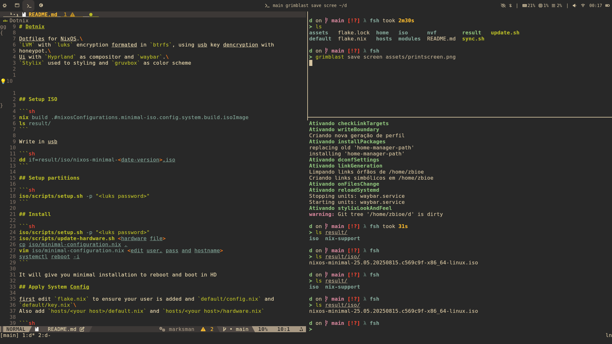

# Dotnix

Dotfiles for [NixOS](nixos.org).  
   
It has [LVM](https://sourceware.org/lvm2/) with [luks](https://gitlab.com/cryptsetup/cryptsetup/blob/master/README.md) encryption and is formated in [btrfs](https://www.kernel.org/doc/html/v6.17-rc1/filesystems/btrfs.html).  
Uses usb key to dencrypt with a honeypot.  
Simple UI with [Hyprland](https://github.com/hyprwm/Hyprland) as compositor and [waybar](https://github.com/Alexays/Waybar). as bar  \
[Stylix](https://github.com/nix-community/stylix) used to styling and [gruvbox](https://github.com/dawikur/base16-gruvbox-scheme) as color scheme   



## Setup ISO

```sh
nix build .#nixosConfigurations.minimal-iso.config.system.build.isoImage
ls result/
```

Write in usb

```sh
dd if=result/iso/nixos-minimal-<date-version>.iso
```

## Setup partitions

```sh
iso/scripts/setup.sh -p "<luks password>"
```

## Install

```sh
iso/scripts/setup.sh -p "<luks password>"
iso/scripts/update-hardware.sh <hardware file>
cp iso/minimal-configuration.nix .
vim iso/minimal-configuration.nix <edit user, pass and hostname>
systemctl reboot -i
```

It will give you minimal installation to reboot and boot in HD

## Apply System Config

first edit `flake.nix` to ensure your user is added and `default/config.nix` and
`default/key.nix`\
Also add `hosts/<your host>/default.nix` and `hosts/<your host>/hardware.nix`

```sh
sudo nixos-rebuild switch --flake .#<hostname>
```

## Apply Home Manager

```sh
home-manager switch --flake .#<hostname>
```

## Add Key in USB

[Wiki](https://nixos.wiki/wiki/Full_Disk_Encryption)

### Generate and add key in LUKS

```sh
dd if=/dev/random of=hdd.key bs=4096 count=1
cryptsetup luksAddKey /dev/disk/by-id/<usb id> ./hdd.key
```

### Setup your Key in usb wih a honeypot

first format your usb with `fdisk` and skip at least `6144` bytes
before first partition.\
after it format the partition to vfat and you will can use it like any other pen
drive.\
For finish it, you will put the key after `2048` bytes.

```sh
dd if=hdd.key of=/dev/disk/by-id/<usb id> bs=1 seek=2048
```

### Configure it in your hardware.nix

```nix
boot.initrd = {
  luks.devices = {
    enc = {
      device = "/dev/disk/by-uuid/<device uuid>"; #luks device
      keyFileSize = 4096;
      keyFileOffset = 2048;
      keyFileTimeout = 10; # put it to fallback to password after 10s
      keyFile = "/dev/disk/by-id/<usb id>";
    };
  };
};
```

After it you will have a pen drive working as media, and workings as usb key.   
Put some honeypot on it, and if someone find it, will not know it is a luks key.
